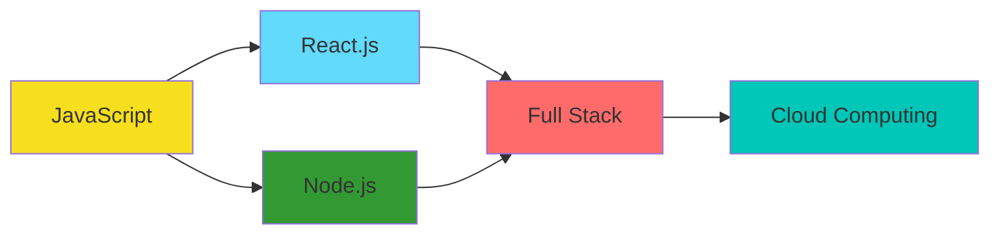

<div align="center">

# 👨‍💻 Ricardo Linhares

[](https://git.io/typing-svg)

[](https://www.linkedin.com/in/ricardo-linhares-6a1a73324/)
[](mailto:ricardo.dkt@gmail.com)
[](https://github.com/ricardoslinhares)


</div>

---

## 🚀 About Me

```javascript
const ricardo = {
    location: "Brazil 🇧🇷",
    education: "Systems Analysis & Development",
    currentFocus: "Full Stack Development",
    learningGoals: ["Advanced JavaScript", "React", "Node.js", "Cloud Computing"],
    interests: ["Web Development", "Open Source", "Problem Solving"],
    funFact: "I turn coffee into code ☕➡️💻"
};
```

---

## ⚡ Recent Activity

<!--START_SECTION:activity-->
1. 🗣 Commented on [#622](https://github.com/Lacro59/playnite-successstory-plugin/issues/622#issuecomment-3658355838) in [Lacro59/playnite-successstory-plugin](https://github.com/Lacro59/playnite-successstory-plugin)
2. ❌ Merged PR [#2](undefined) in [ricardoslinhares/skills-getting-started-with-github-copilot](https://github.com/ricardoslinhares/skills-getting-started-with-github-copilot)
3. 💪 Opened PR [#2](undefined) in [ricardoslinhares/skills-getting-started-with-github-copilot](https://github.com/ricardoslinhares/skills-getting-started-with-github-copilot)
4.  Labeled issue [#1](https://github.com/ricardoslinhares/skills-write-javascript-actions/issues/1) in [ricardoslinhares/skills-write-javascript-actions](https://github.com/ricardoslinhares/skills-write-javascript-actions)
5.  Labeled issue [#1](https://github.com/ricardoslinhares/skills-write-javascript-actions/issues/1) in [ricardoslinhares/skills-write-javascript-actions](https://github.com/ricardoslinhares/skills-write-javascript-actions)
6. 💪 Opened PR [#2](undefined) in [ricardoslinhares/skills-communicate-using-markdown](https://github.com/ricardoslinhares/skills-communicate-using-markdown)
7. ❌ Merged PR [#2](undefined) in [ricardoslinhares/skills-introduction-to-github](https://github.com/ricardoslinhares/skills-introduction-to-github)
8. 💪 Opened PR [#2](undefined) in [ricardoslinhares/skills-introduction-to-github](https://github.com/ricardoslinhares/skills-introduction-to-github)
9. 🚀 Published release [v1.2.0 - Conteúdo Expandido](https://github.com/ricardoslinhares/guiadev/releases/tag/v1.2.0) in [ricardoslinhares/guiadev](https://github.com/ricardoslinhares/guiadev)
<!--END_SECTION:activity-->

---

## 📊 GitHub Analytics

<div align="center">
  
  
</div>

<div align="center">
  
</div>

<div align="center">
  
</div>

---

## 💻 Tech Stack

<div align="center">

### Languages


### Databases


### Tools & Technologies


</div>

---

## 🎯 Featured Projects

<div align="center">

<table>
<tr>
<td width="50%">
<h3 align="center">🧭 GuiaDev</h3>
<div align="center">
<a href="https://github.com/ricardoslinhares/guiadev" target="_blank">

</a>
<p>
<a href="https://github.com/ricardoslinhares/guiadev" target="_blank">

</a>
</p>
<p><strong>JavaScript, HTML, CSS</strong> - Interactive guide for beginner developers with best practices (University Extension Project)</p>
</div>
</td>

<td width="50%">
<h3 align="center">📚 JSCodes</h3>
<div align="center">
<a href="https://github.com/ricardoslinhares/jscodes" target="_blank">

</a>
<p>
<a href="https://github.com/ricardoslinhares/jscodes" target="_blank">

</a>
</p>
<p><strong>JavaScript</strong> - Collection of JavaScript studies exploring fundamental and advanced concepts</p>
</div>
</td>
</tr>

<tr>
<td width="50%">
<h3 align="center">🐍 Python Projects</h3>
<div align="center">
<a href="https://github.com/ricardoslinhares/python" target="_blank">

</a>
<p>
<a href="https://github.com/ricardoslinhares/python" target="_blank">

</a>
</p>
<p><strong>Python</strong> - Python learning journey with various projects and exercises</p>
</div>
</td>

<td width="50%">
<h3 align="center">🎓 Final Project</h3>
<div align="center">
<a href="https://github.com/ricardoslinhares/final-project" target="_blank">

</a>
<p>
<a href="https://github.com/ricardoslinhares/final-project" target="_blank">

</a>
</p>
<p><strong>Full Stack</strong> - Capstone project demonstrating comprehensive development skills</p>
</div>
</td>
</tr>
</table>

</div>

### 🎮 More Projects

<details>
<summary>Click to expand</summary>

- 📝 **[Grade System](https://github.com/ricardoslinhares/sistema-de-notas)** - Student grade management system with JavaScript
- 🎲 **[Number Generator](https://github.com/ricardoslinhares/sorteador-numeros)** - Random number generator with custom range
- 🎮 **[Secret Number Game](https://github.com/ricardoslinhares/jogonumerosecretojs)** - Interactive guessing game with hints
- 🎁 **[Secret Santa](https://github.com/ricardoslinhares/amigo-secreto)** - Secret Santa draw application

</details>

---

## 📈 Contribution Graph

<div align="center">

[](https://github.com/ashutosh00710/github-readme-activity-graph)

</div>

---

## 🎓 Currently Learning

<div align="center">



</div>

---

## 💡 Quote of the Day

<div align="center">


</div>

---

<div align="center">

### 🤝 Let's Connect!

I'm always open to collaborating on interesting projects or discussing new ideas!

[](https://www.linkedin.com/in/ricardo-linhares-6a1a73324/)
[](mailto:ricardo.dkt@gmail.com)
[](https://github.com/ricardoslinhares)

---


---

**⭐️ From [ricardoslinhares](https://github.com/ricardoslinhares) with 💙**

*"The only way to do great work is to love what you do" - Steve Jobs*

</div>
